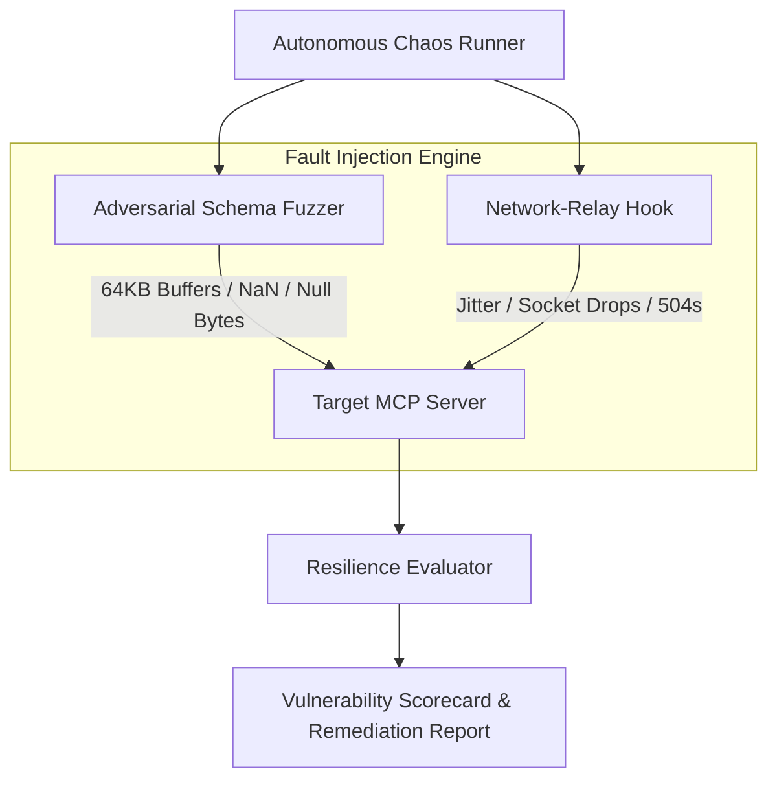

# Havoc

> **Autonomous AI QA & Chaos Resilience Testing Engine for Distributed Tool Pipelines.**

[](https://opensource.org/licenses/MIT)
[](https://www.typescriptlang.org/)
[](https://modelcontextprotocol.io/)

---

## What is Havoc?

AI agents in production face hostile, unpredictable environments: third-party APIs fail with `HTTP 504 Gateway Timeout`, rate limits trigger sudden `HTTP 429 Too Many Requests`, edge connections drop packets, and LLMs hallucinate malformed tool arguments.

**Havoc** brings **Chaos Engineering to the Model Context Protocol (MCP)**. It acts as an autonomous QA fuzzer that injects synthetic network jitter, socket drops, type-poisoned payloads, and circular subagent recursion traps into your agent pipeline to discover fatal bugs *before* your users do.



---

## Core Features

- **Network-Relay Emulation**: Simulates real-world network instability (800ms–2500ms latency spikes, socket resets, bandwidth throttling) by bridging with [`network-relay`](https://github.com/bhavukar/network-relay).
- **Adversarial Schema Fuzzing**: Automatically mutates MCP tool input schemas with NaN values, 64KB string overflows, Unicode control characters, and malformed JSON envelopes.
- **Cascade Outage Verification**: Tests whether your agent gracefully fails over to cached responses or secondary replicas during upstream HTTP 504 and 429 surges.
- **Subagent Deadlock Detection**: Identifies circular agent invocation loops and runaway memory context growth before token quotas are drained.
- **Automated Resilience Scorecards**: Generates JUnit / JSON vulnerability reports with actionable code remediation instructions.

---

## Quickstart

### 1. Run Pre-Flight Chaos Suite via CLI
```bash
npx havoc test --target ./my-mcp-server --severity aggressive
```

### 2. Add to GitHub Actions CI/CD Pipeline
```yaml
name: MCP Resilience Test
on: [push, pull_request]

jobs:
  chaos:
    runs-on: ubuntu-latest
    steps:
      - uses: actions/checkout@v4
      - name: Run Autonomous Chaos Fuzzing
        run: |
          npx havoc test --target ./src/server.ts --fail-threshold 80
```

### 3. Programmatic Node.js SDK
```typescript
import { ChaosRunner, SchemaFuzzer } from 'havoc-engine';

const runner = new ChaosRunner();
const report = await runner.runSuite({
  id: 'pre-flight-suite',
  name: 'Production Pre-Flight',
  severity: 'aggressive',
  faults: [
    { type: 'latency_spike', probability: 0.4, latencyMs: 1500 },
    { type: 'malformed_payload', probability: 0.3 }
  ]
});

console.log(`Resilience Score: ${report.resilienceScore}%`);
```

---

## Interactive Web Landing Page

The project includes an interactive web demo inspired by Cuberto digital architecture with pill buttons and chaos attack playground.

To launch the web interface locally:
```bash
npx serve web
# or open web/index.html in any browser
```

---

## License

MIT License (c) 2026 Bhavuk Arora
